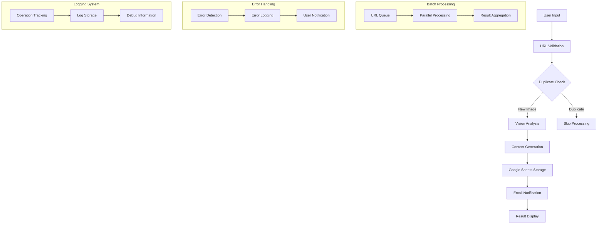

# Fashion Content Agent Architecture

## System Overview

The Fashion Content Agent is a Streamlit-based web application that automates the generation of marketing content for fashion images. The system integrates multiple services and components to provide a seamless content generation pipeline with robust error handling, logging, and batch processing capabilities.

## Core Components

### 1. User Interface Layer
- **Technology**: Streamlit
- **Purpose**: Provides an interactive web interface for users to:
  - Input multiple image URLs (up to 3)
  - Customize Google Sheet names
  - Input sharing email addresses
  - View processing status and results
  - Display success/error messages
  - Show progress indicators

### 2. Image Processing Pipeline
- **Components**:
  - Image URL Validator
  - Duplicate Detection System
  - Vision Analysis Engine
  - Content Generation Engine
  - Batch Processing Controller

### 3. Data Storage Layer
- **Primary Storage**: Google Sheets
- **Cache System**: Local cache for duplicate detection
- **Logging System**: Comprehensive logging for operations and errors

## Data Flow

## Component Details

### 1. Image URL Validator
- Validates accessibility of provided URLs
- Supports various image sources including Google Drive
- Implements error handling for invalid or inaccessible URLs
- Batch validation capabilities

### 2. Duplicate Detection System
- Maintains a cache of processed images using ImageHashCache
- Uses perceptual hashing (average_hash) for image comparison
- Implements Hamming distance-based similarity detection
- Features:
  - Configurable similarity threshold
  - Efficient cache management
  - Support for similar but not identical images
  - Automatic cache cleanup
  - Batch processing support
- Prevents redundant processing while allowing for similar variations
- Optimizes resource usage through efficient hashing

### 3. Vision Analysis Engine
- Analyzes fashion images for:
  - Product categories
  - Style elements
  - Color schemes
  - Design details
- Batch processing support

### 4. Content Generation Engine
- Generates multiple content types:
  - Product titles
  - Descriptions
  - Marketing captions
  - SEO-friendly hashtags
  - Alt text for accessibility
- Parallel processing capabilities

### 5. Google Sheets Integration
- Features:
  - Automatic sheet creation
  - Result storage
  - Access management
  - Share permissions handling
  - Email notification system

### 6. Logging System
- Comprehensive logging covering:
  - Operation tracking
  - Error handling
  - Performance monitoring
  - Debug information
  - Batch operation logging

### 7. Batch Processing Controller
- Features:
  - Queue management
  - Parallel processing
  - Result aggregation
  - Error handling
  - Progress tracking

## Security Considerations

1. **Authentication**:
   - Google service account authentication
   - Secure credential management
   - Token validation

2. **Access Control**:
   - Email-based sharing system
   - Controlled access to results
   - Permission validation

3. **Data Protection**:
   - Secure handling of user inputs
   - Protected storage of results
   - Cache security

## Testing Architecture

- All tests use `pytest` with fixtures and patching to ensure isolation and prevent side effects.
- Tests are grouped by feature (batch processing, logging, duplicate detection, etc.) and can be run individually or as a suite.
- Markers (see `pytest.ini`) allow for targeted test runs (e.g., `-m batch` for batch processing tests).
- The test suite is designed for reliability and maintainability, supporting rapid development and refactoring.

1. **Unit Tests**:
   - Batch processing tests
   - Email notification tests
   - Logging system tests
   - Duplicate detection tests
   - URL validation tests

2. **Integration Tests**:
   - Component interaction tests
   - API integration tests
   - Error handling tests

3. **Test Coverage**:
   - Core functionality
   - Edge cases
   - Error scenarios
   - Performance aspects

## Performance Considerations

1. **Optimization Techniques**:
   - Batch processing
   - Caching
   - Parallel processing
   - Resource pooling

2. **Resource Management**:
   - Memory efficient operations
   - CPU utilization optimization
   - Cache cleanup
   - Connection pooling

## Error Handling

1. **Error Types**:
   - URL validation errors
   - Processing failures
   - API errors
   - Authentication errors
   - Permission errors

2. **Recovery Mechanisms**:
   - Automatic retries
   - Graceful degradation
   - User notifications
   - Error logging

## Monitoring and Maintenance

1. **Logging System**:
   - Operation tracking
   - Error monitoring
   - Performance metrics
   - User activity logging

2. **Maintenance Procedures**:
   - Cache management
   - Error recovery
   - System updates
   - Performance optimization

## Future Extensibility

The architecture is designed to be extensible for:
1. Additional content types
2. New analysis features
3. Alternative storage solutions
4. Enhanced customization options
5. Integration with other services
6. Increased batch processing capacity
7. Advanced caching mechanisms

## Technical Dependencies

1. **Core Dependencies**:
   - Streamlit for UI
   - Google Sheets API
   - Vision Analysis libraries
   - Content Generation services
   - Testing frameworks

2. **Supporting Libraries**:
   - Logging framework
   - Testing utilities
   - HTTP clients
   - Caching libraries

This architecture document provides a comprehensive overview of the Fashion Content Agent system, its components, and their interactions. It serves as a guide for understanding the system's structure and for future development and maintenance. 